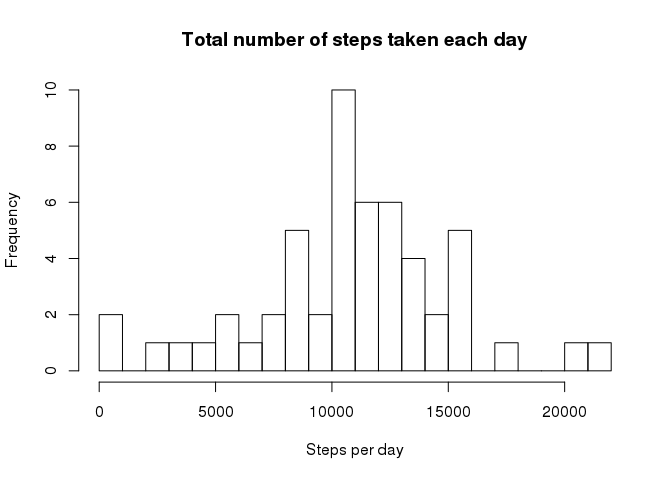
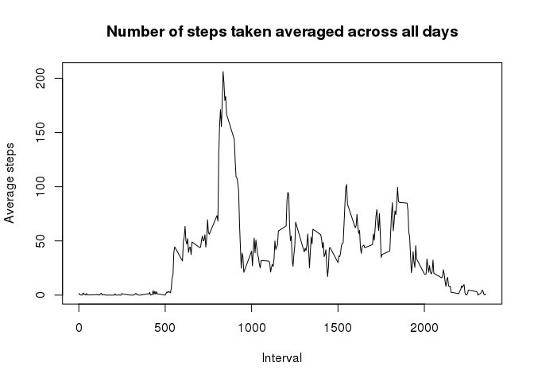
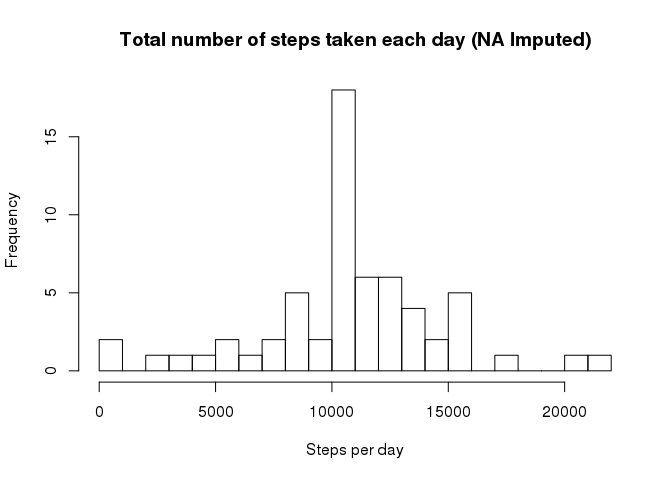
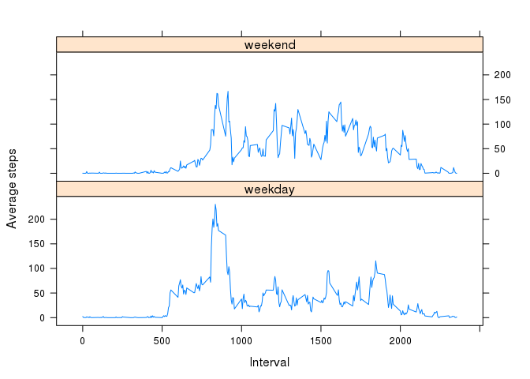

# Reproducible Research: Peer Assessment 1


## Loading and preprocessing the data


```r
# Code for: Load the data (i.e. read.csv())
activity.0 <- read.csv(unz("activity.zip", "activity.csv")) # Original data set
# activity.0$date <- as.Date(activity.0$date)
activity.1 <- na.omit(activity.0) # Data set with NA omitted
```

## What is mean total number of steps taken per day?

Using the data table package to consider the total number of steps taken each day, and average them. Remove NA values, use na.omit and summate the activity data by date

```r
require(data.table)
```

```
## Loading required package: data.table
```

```r
# Code for: Calculate the total number of steps taken per day
activity.bydate <- data.table(activity.1)[, list(total.steps = sum(steps)), by = date]
head(activity.bydate)
```

```
##          date total.steps
## 1: 2012-10-02         126
## 2: 2012-10-03       11352
## 3: 2012-10-04       12116
## 4: 2012-10-05       13294
## 5: 2012-10-06       15420
## 6: 2012-10-07       11015
```


```r
# Code for: If you do not understand the difference between a histogram and a barplot, research the difference between them. Make a histogram of the total number of steps taken each day
hist(activity.bydate$total.steps, breaks = 20, xlab = "Steps per day", main = "Total number of steps taken each day")
```



Calculate the mean and median of the total number of steps taken per day

```r
# Code for: Calculate and report the mean and median of the total number of steps taken per day
mean(activity.bydate$total.steps)
```

```
## [1] 10766.19
```

```r
median(activity.bydate$total.steps)
```

```
## [1] 10765
```

## What is the average daily activity pattern?


```r
# Code for: Make a time series plot (i.e. type = "l") of the 5-minute interval (x-axis) and the average number of steps taken, averaged across all days (y-axis)
activity.byinterval <- data.table(activity.1)[, list(average.steps = mean(steps)), by = interval]
head(activity.byinterval)
```

```
##    interval average.steps
## 1:        0     1.7169811
## 2:        5     0.3396226
## 3:       10     0.1320755
## 4:       15     0.1509434
## 5:       20     0.0754717
## 6:       25     2.0943396
```

```r
plot(x = activity.byinterval$interval, y = activity.byinterval$average.steps, type = "l", xlab = "Interval", ylab = "Average steps", main = "Number of steps taken averaged across all days")
```



```r
# Code for: Which 5-minute interval, on average across all the days in the dataset, contains the maximum number of steps?
activity.byinterval[activity.byinterval$average.steps == max(activity.byinterval$average.steps),]
```

```
##    interval average.steps
## 1:      835      206.1698
```


## Imputing missing values


```r
# Code for: Calculate and report the total number of missing values in the dataset (i.e. the total number of rows with NAs)
sum(is.na(activity.0$steps))
```

```
## [1] 2304
```

```r
# Code for: Devise a strategy for filling in all of the missing values in the dataset. The strategy does not need to be sophisticated. For example, you could use the mean/median for that day, or the mean for that 5-minute interval, etc.
activity.2 <- activity.0
# A for loop going through each row in our dataset, and replacing NA values with the average value across that time interval. 
for (i in 1:nrow(activity.2)) {
  if (is.na(activity.2[i,1])) {
    activity.2[i,1] <- activity.byinterval[which(activity.2$interval[i] == activity.byinterval$interval),]$average.steps
  }
}

# Code for: Create a new dataset that is equal to the original dataset but with the missing data filled in.
# Dataset created as part of question above (activity.2)
head(activity.2)
```

```
##       steps       date interval
## 1 1.7169811 2012-10-01        0
## 2 0.3396226 2012-10-01        5
## 3 0.1320755 2012-10-01       10
## 4 0.1509434 2012-10-01       15
## 5 0.0754717 2012-10-01       20
## 6 2.0943396 2012-10-01       25
```

```r
# Code for: Make a histogram of the total number of steps taken each day and Calculate and report the mean and median total number of steps taken per day. Do these values differ from the estimates from the first part of the assignment? What is the impact of imputing missing data on the estimates of the total daily number of steps?
activity.bydate2 <- data.table(activity.2)[, list(total.steps = sum(steps)), by = date]
head(activity.bydate2)
```

```
##          date total.steps
## 1: 2012-10-01    10766.19
## 2: 2012-10-02      126.00
## 3: 2012-10-03    11352.00
## 4: 2012-10-04    12116.00
## 5: 2012-10-05    13294.00
## 6: 2012-10-06    15420.00
```

```r
hist(activity.bydate2$total.steps, breaks = 20, xlab = "Steps per day", main = "Total number of steps taken each day (NA Imputed)")
```



Calculate the mean and median of the total number of steps taken per day

```r
# Code for: Calculate and report the mean and median of the total number of steps taken per day
mean(activity.bydate2$total.steps)
```

```
## [1] 10766.19
```

```r
median(activity.bydate2$total.steps)
```

```
## [1] 10766.19
```
Do these values differ from the estimates from the first part of the assignment?

```r
# Check if they are they same: 
mean(activity.bydate2$total.steps) == mean(activity.bydate$total.steps)
```

```
## [1] TRUE
```

```r
median(activity.bydate2$total.steps) == median(activity.bydate$total.steps)
```

```
## [1] FALSE
```
The mean is the same but the median is slightly higher. 

```r
median(activity.bydate2$total.steps) - median(activity.bydate$total.steps)
```

```
## [1] 1.188679
```
To be expected because we are using data from our average-in-that-time-period set to impute our missing values. Median per day is higher because we were previously excluding our missing values (they were not considered in our previous calculations). 


## Are there differences in activity patterns between weekdays and weekends?

Use dataset with filled in missing values


```r
# Code for: Create a new factor variable in the dataset with two levels – “weekday” and “weekend” indicating whether a given date is a weekday or weekend day.
activity.3 <- activity.2

# Add a new column showing day of the week
activity.3$day <- weekdays(as.Date(activity.3$date))
head(activity.3)
```

```
##       steps       date interval    day
## 1 1.7169811 2012-10-01        0 Monday
## 2 0.3396226 2012-10-01        5 Monday
## 3 0.1320755 2012-10-01       10 Monday
## 4 0.1509434 2012-10-01       15 Monday
## 5 0.0754717 2012-10-01       20 Monday
## 6 2.0943396 2012-10-01       25 Monday
```

```r
# Define which days are classified weekdays and which days are weekends. 
weekday <- c("Monday", "Tuesday", "Wednesday", "Thursday", "Friday")
weekend <- c("Saturday", "Sunday")

# For loop going through each entry, if the day column value is classified as a weekday overwrite as "weekday", if classified as a weekend overwrite as "weekend"
for (i in 1:nrow(activity.3)) {
  if (grepl(pattern = paste(weekday, collapse = "|"), activity.3[i,4])) {
    activity.3[i,4] <- "weekday"
  }
  else if (grepl(pattern = paste(weekend, collapse = "|"), activity.3[i,4])) {
    activity.3[i,4] <- "weekend"
  }
}

head(activity.3)
```

```
##       steps       date interval     day
## 1 1.7169811 2012-10-01        0 weekday
## 2 0.3396226 2012-10-01        5 weekday
## 3 0.1320755 2012-10-01       10 weekday
## 4 0.1509434 2012-10-01       15 weekday
## 5 0.0754717 2012-10-01       20 weekday
## 6 2.0943396 2012-10-01       25 weekday
```

```r
# Code for: Make a panel plot containing a time series plot (i.e. type = "l") of the 5-minute interval (x-axis) and the average number of steps taken, averaged across all weekday days or weekend days (y-axis). See the README file in the GitHub repository to see an example of what this plot should look like using simulated data.

# Make a tidy data.frame to read into lattice
activity.byinterval.weekday <- data.table(activity.3[activity.3$day == "weekday",])[, list(average.steps = mean(steps)), by = interval]
activity.byinterval.weekend <- data.table(activity.3[activity.3$day == "weekend",])[, list(average.steps = mean(steps)), by = interval]

activity.byinterval.weekday$day <- "weekday"
activity.byinterval.weekend$day <- "weekend"

activity.byinterval3 <- rbind(activity.byinterval.weekday, activity.byinterval.weekend)

library(lattice)
xyplot(activity.byinterval3$average.steps ~ activity.byinterval3$interval | activity.byinterval3$day, layout = c(1, 2), type = "l", xlab = "Interval", ylab = "Average steps")
```


